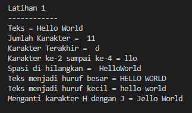
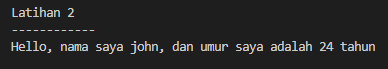

| # | Biodata |
| -------- | --- |
| **Nama** | M. Hannata Zahri |
| **NIM** | 312010318 |
| **Kelas** | TI.20.A.2 |
| **Mata Kuliah** | Bahasa Pemrograman |
#
## Praktikum 12
### String Python
#
## Code Program
* ### Latihan 1
```python
teks = 'Hello World'
print(f"Teks = {teks}")
# Menghitung jumlah karakter
print("Jumlah Karakter = ",len(teks))
# Mengambil karakter terakhir
a = teks[-1]
print('Karakter Terakhir = ',a)
# Mengambil karakter ke-2 sampai ke-4
b = teks[2:5]
print(f"Karakter ke-2 sampai ke-4 = {b}")
# Hilangkan spasi pada text 
c = teks.replace(" ","")
print("Spasi di hilangkan = ",c)
# Ubah teks menjadi huruf besar
d = teks.upper()
print(f"Teks menjadi huruf besar = {d}")
# Ubah teks menjadi huruf kecil
e = teks.lower()
print(f"Teks menjadi huruf kecil = {e}")
# Ganti karakter H dengan karakter J
f = teks.replace("H","J")
print(f"Menganti karakter H dengan J = {f}")
```
* ### Latihan 2
```python
umur = 24
teks = 'Hello, nama saya john, dan umur saya adalah {0} tahun'
print(teks.format(umur))
```
#
## Output Program
* ### Latihan 1

* ### Latihan 2
